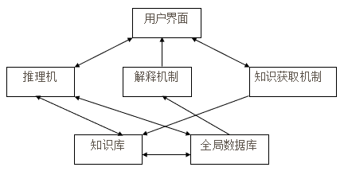

[TOC]
# 重点需要熟悉的内容
## 第一章
- 人工智能中的几个最基本概念，如：什么是人工智能？
- 基本的，其他复杂的不用管
- 人工智能研究些啥？
## 第二章
### 第一节
- 专家系统的概念，到底是什么
- 专家系统的结构，结构图关系的含义
- 结构解释清楚。要进行描述
### 第二节
开发不管
### 第三节
问题求解 两种搜索方法，非常详细地讲了，重点
### 第四节
知识的概括、分类表达：知识的定义，什么是知识，什么是空间知识？为什么分成那么多种？道理弄明白
### 第六节
知识的产生式表达
知识的产生式表达方法：IF THEN，前提 结论，条件 结论
产生式系统、和专家系统的结构、模块之间的关系，需要掌握
### 第七节
知识的结构化表达，花了很多时间讲：框架表示、判定表表示必须掌握。框架表示的结构，判定表的理论结构、应用。要知道应用方法，相应的推理方法。
语义网络只需要基本概念。

## 第三章
了解知识获取与机器学习的基本概念、方法
到底怎么获取知识，有什么方法，基本常识。就是第一节。
就是各种方法。

## 第四章
地图模式识别基本概念，到底是啥
点状地图符号识别的时候的三种方法，以及数据处理流程
三种方法：结构、统计、还有一种？

地图模式识别的时候，有些识别方法是可以通过特殊的特征直接进行识别。并不是传统的三种方法

## 第五章
第1、3节
地学知识基本概念
第三节地学知识表达、管理推理方法

## 第六章
第二节，地图设计中地图制图知识到底是指什么，有哪些类别？
第三节，分幅和图面设计，了解一下图面设计的决策方法，到底怎么进行决策，决策的过程

第四节，基于知识的地图投影选择。必须结合作业，仔细学习。
考试的时候强行用规则、判定表描述地图投影选择的知识。理解里面的知识有哪一些，是怎么考虑的。
必须结合前面已经学过的知识表达方法重新思考。
有个问题是，原来用得框架，框架怎么转换成产生式规则，产生式规则怎么变成判定表。表达规则的转换。第二章的第6、7节，很重要。
应用相关的都是应用题，至少15、一般20分。

第五节，统计地图中地图符号的选择。强调符号的选择过程，符号是怎么选择的，决策的过程。
不用记是啥啥专家，不考表。是考知识经验怎么表达清楚，怎么用这些知识去推理得到结论。地图符号的选择过程是怎么样的，155页。

第六节，强调语意数据的重要性。只需要掌握第六节的1、2、3是怎么描述的。后面怎么建立关系的方法没详细讲。
数据，点线面、统计表中的数据怎么办？也有语意，语意中的关系。数据中的关系怎么描述？

第7、8、9、10
7：色彩在运用中注意些什么。重点从应用学习。问你：那几个图在色彩设计中如何使用相关的知识？地图设计中的色彩设计中设计哪些知识，如何表达。在一个表达方法下，如何为地图选择色彩？和地图投影选择类似。
地图投影、色彩、方法..核心是知识表达、推理。第二章第七节。
8、9、10知识性的了解。弄明白第八节，符号的类型中，哪些规则需要放在算法中。
9，绿砖，有这么多因素要考虑。
算法中如何考虑知识。
10、没有实习，软件方面了解，看懂就行。

## 第七章：今天讲的。
两个问题：
1。地图注记配置中规则、知识可以用哪些方式来进行表达？
除了规则之外，产生式规则、谓词、判定表，还有算法、过程
注记的配置中，如何建立最优化模型。相对于自动配置，可以是随机的方法，可以是基于规则的方法，可以是贪婪方法。
注记配置的最优化模型与贪婪方式的差异在哪？
总结出差异，要写清楚。

第三节，第四节，第五第六，
7、8不管
六节最优化组合掌握：第一部分，就是课堂上讲的，最优化组合模型。2、3不管。最优化的模型理解透，数学上的描述，函数的定义，具体应用状态要直接相关，等价的、描述清楚。
问：地图注记自动配置中，如何设计评价模型？
怎么答？
就是目标函数，状态好还是不好就是评价，评价就是目标函数。
直接的问题：已知M个目标、点，设计出最优化组合模型。（抄书）
约束条件。书本上，后脚条件加起来为1。但可以都是0。约束条件变。
或者说，不需要数学描述，用贪婪的方法。

作业回忆一下怎么做的
优秀的地图，状态、包含的知识如何表达清楚？20分
地图内容，哪些槽，那些侧面，举例说明就完了。

重点掌握的就必须要背

# 第一章：人工智能概述
- 人工智能研究对象
> 人工智能研究如何用人工的方法和技术，即用各种自动机器或智能机器（主要指计算机或智能机）模仿、延伸和扩展人的智能，实现某些“机器思维”或脑力劳动自动化。

# 第二章：专家系统与知识工程
## 专家系统的基本概念
> 专家系统，就是具有相当专家的知识和经验水平，以及解决专门问题能力的计算机系统
- 专家系统 = 知识 + 推理
- 传统程序 = 数据 + 算法
- 专家系统知识组织采用三级结构：数据级（上下文）、知识库级、控制级（推理机）
## 专家系统的结构和功能

- 用户界面
> 专家系统和用户之间进行通信和信息交换的媒介。
- 知识库（包括知识库管理系统）
    - 知识库是问题域中知识的集合，包括基本事实、规则和其他有关信息。 
    - 知识库是专家系统的核心组成部分，决定了专家系统能力的大小。
    - 知识库是主动的、动态的，事实和规则一旦被应用，便会产生新事实和新知识。
    - 知识库中的知识包括：专家知识、领域知识、元知识。
    - 知识库管理系统用于存取和管理所获取的专家知识和经验，供推理机利用。
- 全局数据库
    - 也称动态数据库、综合数据库、工作存储器、黑板。
    - 反映当前问题求解状态的集合，用于临时存放求解问题所需的各种初始数据或证据，以及求解期间各种中间信息
    - **是推理机选用知识的依据，也是解释机制获得推理路径的来源。**
    - 与通常的数据库有本质差异
- 推理机（包括推理机控制系统）
    - 实现推理的程序，由调度程序和解释程序组成，是实施问题求解的核心执行机构。利用知识进行推理
    - 调度程序依据全局数据库中当前问题状态及有关信息，按一定策略从知识库中识别、选取可用知识。
    - 解释程序根据知识语义，对找到的知识进行解释执行，并把结果记录到全局数据库中。
- 解释机制
    - 回答用户询问、对自己的问题求解过程或求解状态提供说明的机构。
    - 咨询理解：将输入转为推理机可接收的信息
    - 结论解释：向用户输出推理的结论、答案
- 知识获取机制
> 把问题求解的各种专门知识，从人类专家的头脑中或其他知识源那里转换到知识库中的一个重要机构。
## 问题求解的基本原理和方法
- 综合数据库的所有可能状态的全体称为状态空间
- 搜索最基本形式：
    - 树式搜索
    - 线式搜索
        - 不回溯
        - 可回溯
- 状态图搜索方法：
    - 盲目搜索
    - 启发式搜索
- 搜索范围扩展顺序：
    - 广度优先
    - 深度优先
### 广度优先搜索方法（重点）
### 深度优先搜索方法（重点）
### 启发式搜索方法
- 全局择优搜索
- 加权状态图搜索
- 启发式图搜索的A方法与A*方法
## 知识的概念、分类和表达策略
- 知识的概念
    - 人类在实践中所积累的认识和经验的综合
    - 三维空间描述
        - 知识的范围，从具体到一般
        - 知识的目的，从说明性到指定性
        - 知识的有效性，从精确到不精确
- 知识的类型
    - 人工智能中，常分三类
        - 叙述型知识：叙述关于系统状态、环境和条件，问题的概念、定义和事实的知识。
        - 过程型知识：有关系统状态变化、问题求解过程的操作、演算和行动的知识
        - 控制型知识：关于如何选择相应的操作、演算和行动的比较、判断、管理和决策的知识
    - 从问题求解的角度
        - 对象和物体的知识
        - 事件的时序和因果关系等的知识
        - 行为（如何做）知识
        - 元知识（关于知识的知识）
    - 从知识的形成角度
    - 从知识的层次角度
        - 表层知识
        - 深层知识
    - 从知识的确定性程度
        - 确定性知识
        - 模糊知识
    - 从知识的等级角度
        - 元知识
        - 非元知识
## 知识的产生式表达方法与推理
### 产生式系统的基本结构与问题求解过程
- 简单产生式规则格式：
    - 左部：IF、前提、条件
    - 右部：THEN、结论、行动
- 产生式系统组成部分：
    - 事实库：存储有关问题的状态、性质等事实的叙述性知识，包括推理的中间结果和最后结果。也称为综合/全局数据库
    - 规则集：存储有关问题的状态转移、性质变化等规则的过程性知识，称规则库
    - 控制器：根据有关问题的控制性知识，选择控制策略，**将规则与事实进行匹配**，控制利用知识推理求解问题的过程。规则的解释程序
- 产生式系统与专家系统的关系
    - 产生式系统是专家系统的子集
    - 采用产生式规则进行推理，基于产生式规则的专家系统
    - 用产生式规则表达知识
## 知识的结构化表达方法与推理
### 框架表示法
- 对一类经典的实体，比如一个状况、概念、事件，用一个通用的数据结构的形式来存储。新情况发生时，只要把新数据加入这些数据结构就形成了一个具体实体。这样一个典型实体的通用数据结构称为框架。
- [框架](https://blog.csdn.net/hjc256/article/details/88858261)
- [框架](https://wenku.baidu.com/view/8e070addb04e852458fb770bf78a6529647d358f.html)
- 框架推理：
    - 匹配：根据已知事实寻找合适的候选框架
    - 填槽：填写候选框架中的未知槽值，从而寻找出未被给出或尚未发现的事实
### 判定表技术
- 由四个象限组成：条件根、条件项、活动根、活动项。十字交叉的线条分隔开
- 所有条件列在条件根 象限
- 所有活动列在活动根 象限
- [判定表](https://baike.baidu.com/item/%E5%88%A4%E5%AE%9A%E8%A1%A8/7145174?fr=aladdin)
- [判定表](https://www.cnblogs.com/funkyd/p/10885734.html)
### 语义网络表示法
- 节点和弧结构
- 语义网络表示包括四个部分：词法、结构、过程、语义
- 形式上是一个有向图，由一组节点和若干条连接节点的弧构成
- 节点表示问题领域的物体、概念、状态。弧表示节点间的关系
- 语义网络可表示为：{节点a，弧，节点b}

# 第三章 知识获取与机器学习
## 知识获取与机器学习的基本方法
### 知识获取
> 知识从外部知识源到计算机内部的转换过程
    - 确定阶段
    - 概念化阶段
    - 形式化表达和实现
    - 知识库的求精（测试阶段）
- 交谈法
- 观察法
- 草案分析
- 多维技术
### 机器学习
- 记忆学习
- 传授学习
- 演绎学习
- 类比学习
- 实例学习
- 发现学习
- 解释学习
- 人工神经网络

# 第四章 地图模式识别的基本技术
## 地图模式识别的概念
> 地图制图技术与模式识别技术的结合。一种智能技术，研究如何使计算机实现人类对地图的阅读和理解。核心内容是地图符号的自动识别。
## 点状地图符号的识别
- 统计法识别过程
    - 地图扫描输入
    - 地图图像的预处理：二值化、细化、消除噪音等
    - 点状地图符号的分割
    - 特征提取：计算点状地图符号识别的各种特征参数
    - 符号的分类决策
        - 点状地图符号特征库
        - 分类决策模型
    - 识别结果的输出
- 结构法识别过程
    - 输入...
    - 预处理...
    - 分割...
    - 基元的提取与特征描述、基元之间的关系判别
    - 地图符号的识别
        - 点状地图符号的基元特征库
        - 基元之间的关系定义
    - 输出...
- 统计-结构法
    - 输入...
    - 统计识别
    - 结构识别
    - 统计和结构特征库
    - 地图符号的分类结果
- 人工神经网络的点状地图符号识别

# 第五章 基于地学知识的空间数据处理方法
## 地学知识的概念
> 地学知识是地学领域中反映地学现象和过程及其属性的形式化信息，它同样具有一般知识的特征。
## 地图知识表达、管理与推理方法
- 地学知识可以分为三级
    - 因子级知识：解决问题的地学基本概念。
        - 单要素因子，如：坡度、土壤厚度、降雨强度
    - 运算级知识：地学基本原理和专家经验，可得出地学中的专题信息
        - 按照一定地学原理，得出土壤侵蚀强度
    - 决策级知识：规划、决策的经验性知识。长期实践经验的总结。
> 三级知识存在层次关系。  
因子级知识是基础，地理专家系统中知识的最小单位。  
运算级知识是地学中原理和模式，可以得到专题信息，中间计算或推理结果。  
决策级知识是专家的决策经验，得带最终的对策信息。
# 第六章 地图设计的智能化方法

